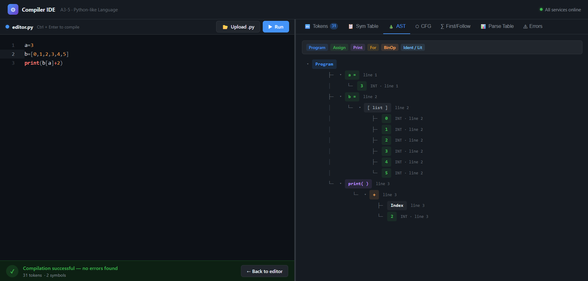

# 🚀 Python Visual Parser

A web-based tool that parses a simplified Python-like language and **visualizes key compiler stages** such as tokenization, symbol tables, and abstract syntax trees (AST).

---

## 🧠 Overview

This project helps you understand how a compiler works internally by breaking down code into different stages:

-  Tokenization  
-  Symbol Table Generation  
-  Abstract Syntax Tree (AST) Construction  
-  Parsing Visualization  

It is designed as an **educational tool** for students learning compilers and programming languages.

---

## ✨ Features

- 📝 Interactive code editor  
- ⚡ Real-time parsing and visualization  
- 🌳 AST visualization  
- 📊 Symbol table display  
- 🔍 Token stream inspection  
- ❌ Error detection and reporting  

---

## 📸 Demo



---

## 🏗️ Project Structure

```
python-visual-parser/
│
├── backend/       # Core parsing logic, AST, compiler stages
├── frontend/      # UI (editor + visualization)
├── middleware/    # API / communication layer
├── image.png      # Demo screenshot
└── README.md
```

---

## ⚙️ How It Works

1. User writes Python-like code in the editor  
2. Code is sent to the backend  
3. Backend performs:
   - Lexical Analysis (tokens)
   - Syntax Analysis (AST)
   - Symbol Table generation  
4. Results are sent back and visualized in the UI  

---

## 🚀 Getting Started

### 1. Clone the repository
```bash
git clone https://github.com/ayushman-77/python-visual-parser.git
cd python-visual-parser
```

---

### 2. Run Backend
```bash
cd backend
mvn spring-boot:run
```

---

### 3. Run Frontend
```bash
cd frontend
npm install
npm run dev
```

---

### 4. Run Middleware
```bash
cd middleware
npm install
npm start
```

---

## 🧪 Example Input

```python
a = 3
b = [0,1,2,3,4,5]
print(b[a] + 2)
```

---

## 📚 Learning Goals

This project helps you understand:

- Compiler design basics  
- Parsing techniques  
- AST representation  
- Symbol tables  
- Language processing pipelines  

---

## 🛠️ Tech Stack

- Frontend: HTML / CSS / JavaScript  
- Backend: Python  
- Middleware: API layer
