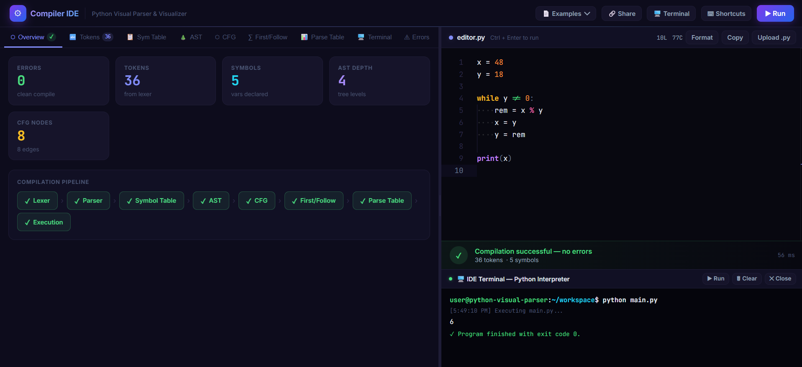

<div align="center">

# Python Visual Parser

**An interactive, educational Compiler IDE that visualizes every stage of compilation for a Python-like language in real-time.**

Write code in the Monaco editor, hit **▶ Run**, and instantly see tokens, AST, CFG, symbol table, First/Follow sets, and the LL(1) parsing table — all as beautiful interactive diagrams.

</div>

---

## 🖥️ Interface



---

## ✨ Features

### 🔤 Lexer / Token Stream
- Tokenizes source code into a fully typed token stream
- Color-coded pill-chain view with type, value, and line number per token
- Live error highlighting for unrecognized characters

### 🌳 AST Visualizer
- Interactive tree powered by **Cytoscape.js** with **dagre** auto-layout
- Zoom, pan, and click nodes to inspect their properties
- Search and highlight any node by label
- Export the full tree as a **PNG**

### 🔀 CFG Visualizer
- Control Flow Graph built directly from the AST
- **Step-through execution simulation** with Play / Pause / Step controls
- Color-coded nodes: entry, exit, condition, body, merge
- Animates the active execution path in real time

### 📋 Symbol Table
- Tracks every variable declaration and assignment
- Infers and displays type (`INT`, `FLOAT`, `STRING`, `BOOL`, `LIST`)
- Shows scope level and declaration line number

### 🔣 First / Follow Sets
- Computed LL(1) First and Follow sets for all grammar non-terminals
- Filtered to only non-terminals reachable from the current program

### 📊 LL(1) Parse Table
- Full grammar production listing
- Complete LL(1) parsing table, filtered to reachable non-terminals
- Cells linked to matching production rule

### 🖥️ Interpreter / Terminal Output
- Executes the code and prints output in a terminal-style panel
- Handles `print`, arithmetic, string concatenation, loops, and conditionals

### ⚠️ Errors Tab
- Aggregated lexer and parser errors in one place
- **Jump to line** — click any error to move the editor cursor directly to it

### 📈 Overview Dashboard
- Summary stats: token count, error count, AST depth, CFG node count
- Pipeline stage indicators showing which stages passed or failed

### ✏️ Monaco Editor
- Custom `python` language with full syntax highlighting
- Auto-indent on Enter (adds 4 spaces after `:`)
- Bracket pair colorization and indent guides


### 📂 File Upload
- Upload any `.py` or `.txt` file directly into the editor

### 🔗 Share
- Generates a shareable URL with the current code embedded as base64
- One-click copy to clipboard

### 🧪 Examples Picker
- 9 built-in sample programs covering every language feature
- Run them instantly to see every visualization panel populated

### ⌨️ Keyboard Shortcuts

| Action | Shortcut |
|---|---|
| Run compiler | `Ctrl + Enter` |
| Toggle shortcuts dialog | `?` |
| Close dialogs | `Esc` |

### 🎨 Design
- Deep purple/indigo glassmorphism dark theme throughout
- Micro-animations, hover effects, smooth panel transitions
- **JetBrains Mono** for code, **Inter** for UI

---

## 🏗️ Architecture

```
┌─────────────────────────────────────────────────────┐
│  Browser  (http://localhost:5173)                   │
│  React 18 + Vite + Monaco Editor + Cytoscape.js     │
└───────────────────────┬─────────────────────────────┘
                        │  /api/*  (Vite proxy)
                        ▼
┌─────────────────────────────────────────────────────┐
│  Node.js Middleware  (http://localhost:3001)        │
│  Express — validates, logs, proxies to Java         │
└───────────────────────┬─────────────────────────────┘
                        │  POST /api/compile
                        ▼
┌─────────────────────────────────────────────────────┐
│  Java Spring Boot Backend  (http://localhost:7070)  │
│  Lexer → Parser → AST → Symbol Table → CFG          │
│         → Interpreter → First/Follow → LL(1) Table  │
└─────────────────────────────────────────────────────┘
```

---

## 🚀 Getting Started

### Prerequisites

- **Java 17+** and **Maven**
- **Node.js 18+** and **npm**

### Run with Docker (Recommended)

Requires [Docker Desktop](https://www.docker.com/products/docker-desktop/) or Docker Compose.

```bash
docker-compose up --build
```
- Frontend: [http://localhost:5173](http://localhost:5173)
- Middleware: http://localhost:3001
- Backend: http://localhost:7070

---

### Run Manually (3 terminals)

**Terminal 1 — Java Backend**
```bash
cd backend
mvn spring-boot:run
# Starts on http://localhost:7070
```

**Terminal 2 — Node.js Middleware**
```bash
cd middleware
npm install        # first time only
node index.js
# Starts on http://localhost:3001
```

**Terminal 3 — Frontend**
```bash
cd frontend
npm install        # first time only
npm run dev
# Open http://localhost:5173
```

> **Tip:** Start the Java backend first. The middleware and frontend can be started in any order after that.

---

## 📝 Supported Language

```python
# Assignment & compound assignment
x = 10
x += 3
x -= 1

# Print (supports multiple arguments)
print(x)
print(x, y)

# For loop with range(start, stop, step)
for i in range(1, 10, 2):
    print(i)

# While loop
while x > 0:
    x -= 1

# If / elif / else
if x > 5:
    print(x)
elif x == 3:
    print(0)
else:
    print(-1)

# Lists & indexing
items = [1, 2, 3, 4]
first = items[0]

# Arithmetic:  +  -  *  /  %
result = (a + b) * c % d

# Comparisons: ==  !=  <  <=  >  >=
```

### Token Reference

| Category | Tokens |
|---|---|
| Keywords | `for`, `in`, `while`, `if`, `elif`, `else`, `print`, `range` |
| Operators | `+`, `-`, `*`, `/`, `%`, `=`, `+=`, `-=` |
| Comparison | `==`, `!=`, `<`, `<=`, `>`, `>=` |
| Literals | `INT_LIT`, `FLOAT_LIT`, `STRING_LIT`, `BOOL_LIT` |
| Structure | `NEWLINE`, `INDENT`, `DEDENT`, `EOF`, `(`, `)`, `[`, `]`, `,`, `:` |

---

## 🛠️ Tech Stack

| Layer | Technology |
|---|---|
| **Frontend** | React 18, Vite, Monaco Editor, Cytoscape.js + dagre |
| **Backend** | Java 17, Spring Boot 3, hand-written LL(1) recursive-descent parser |
| **Middleware** | Node.js 18, Express, Axios |
| **Fonts** | Inter (UI), JetBrains Mono (code) |
| **Design** | Custom CSS — glassmorphism dark theme, micro-animations |

---

## 📁 Project Structure

```
python-visual-parser/
├── backend/                        # Spring Boot Java compiler
│   └── src/main/java/com/compiler/
│       ├── lexer/                  # Tokenizer
│       ├── parser/                 # LL(1) recursive-descent parser
│       ├── ast/                    # AST node type definitions
│       ├── cfg/                    # Control Flow Graph builder
│       ├── symboltable/            # Symbol tracking & type inference
│       ├── Interpreter.java        # Code execution engine / output
│       ├── Main.java               # Compiler pipeline + JSON output
│       └── Server.java             # Spring Boot REST controller
├── middleware/
│   └── index.js                    # Express proxy + request validation
└── frontend/
    ├── index.html                  # Fonts, favicon
    ├── vite.config.js              # /api proxy → :3001
    └── src/
        ├── App.jsx                 # Root: header, workspace, share, shortcuts
        ├── App.css                 # Full design system & dark theme
        └── components/
            ├── Editor.jsx          # Monaco editor + code formatter
            └── ResultPanel.jsx     # 8 output tabs + Cytoscape visualizations
```
